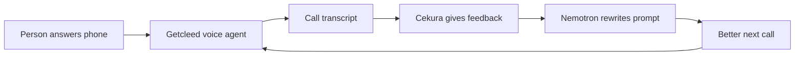

# Coldloop Voice Agent

A self-improving outbound voice agent that learns from failed cold calls.

**Demo video:** [demo](https://www.canva.com/design/DAHLMCHooi0/L_MI1XWENAVp5u6qw2qpvA/edit?ui=e30)

The demo focuses on a real voice-agent failure: the agent calls a company, asks for a specific decision maker, misunderstands the gatekeeper, starts pitching too early, and gets hung up on. Cekura turns that failed call into structured feedback, Nemotron rewrites the prompt, and the same scenario is rerun to show improved behavior.

## Sponsor Stack

| Tool | Role in the system |
| --- | --- |
| NVIDIA Nemotron 3 Super 120B | Live conversation LLM and post-call reflection model. |
| NVIDIA Nemotron Speech | Streaming STT for phone/browser audio. |
| Pipecat | Voice runtime across browser WebRTC, Pipecat Cloud, and Twilio media streams. |
| Cekura | Scenario runner and evaluator that produces transcript-grounded feedback. |
| Gradium | Low-latency TTS for the spoken agent voice. |
| Twilio | Outbound phone calls to real numbers. |

## Infrastructure



## Improvement Loop

The important artifact is the feedback, not just the score. Cekura returns the scenario, expected outcome, transcript, pass/fail result, and explanation. That becomes input to Nemotron, which patches the prompt and saves a new version that the next call uses.

**Before reflection**

```text
Agent: I'm Alex, founder of Getcleed. Can I talk with the CEO?
Gatekeeper: Who are you trying to reach?
Agent: We help sales teams monitor buying signals...
Gatekeeper: Not interested.
```

Failure: the agent treats the gatekeeper like the buyer, pitches too early, and never clarifies the target decision maker.

**After reflection**

```text
Agent: I'm Alex, founder of Getcleed. Is Maya Patel available?
Gatekeeper: What's this about?
Agent: I'm a founder reaching out to Maya about outbound strategy. Is she around?
Gatekeeper: She's in a meeting.
Agent: No problem. When is a better time to try her?
```

Improvement: the agent asks for the specific person, answers the gatekeeper briefly, avoids pitching, and preserves the chance to reach the buyer later.

## Repo Map

- `server/bot-sales.py` - voice agent, tools, prompt loading, transcript capture
- `server/dashboard.py` - local dashboard for calls, Cekura results, prompt diffs, and improvement runs
- `server/improve.py` - CLI improvement loop from transcripts or Cekura feedback
- `server/sales_backend.py` - mock product, prospect, competitor, and scheduling data
- `server/prompt_versions/` - saved prompt versions

## Run Locally

```bash
cd server
cp .env.example .env
uv sync

UV_CACHE_DIR=.uv-cache uv run dashboard.py
```

Open `http://localhost:8501`.

Useful commands:

```bash
UV_CACHE_DIR=.uv-cache uv run bot-sales.py
UV_CACHE_DIR=.uv-cache uv run improve.py --status
```
